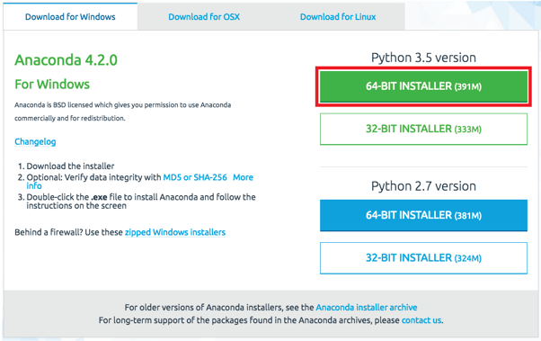
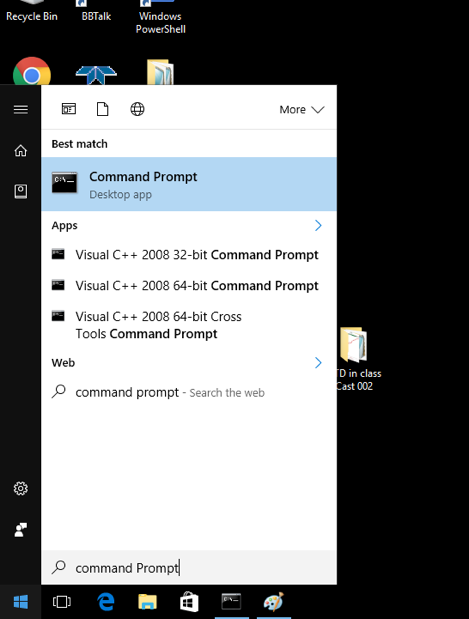
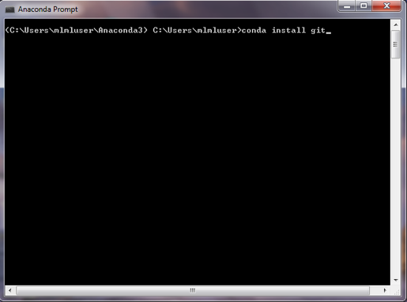
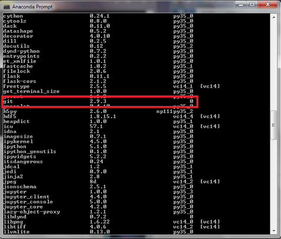
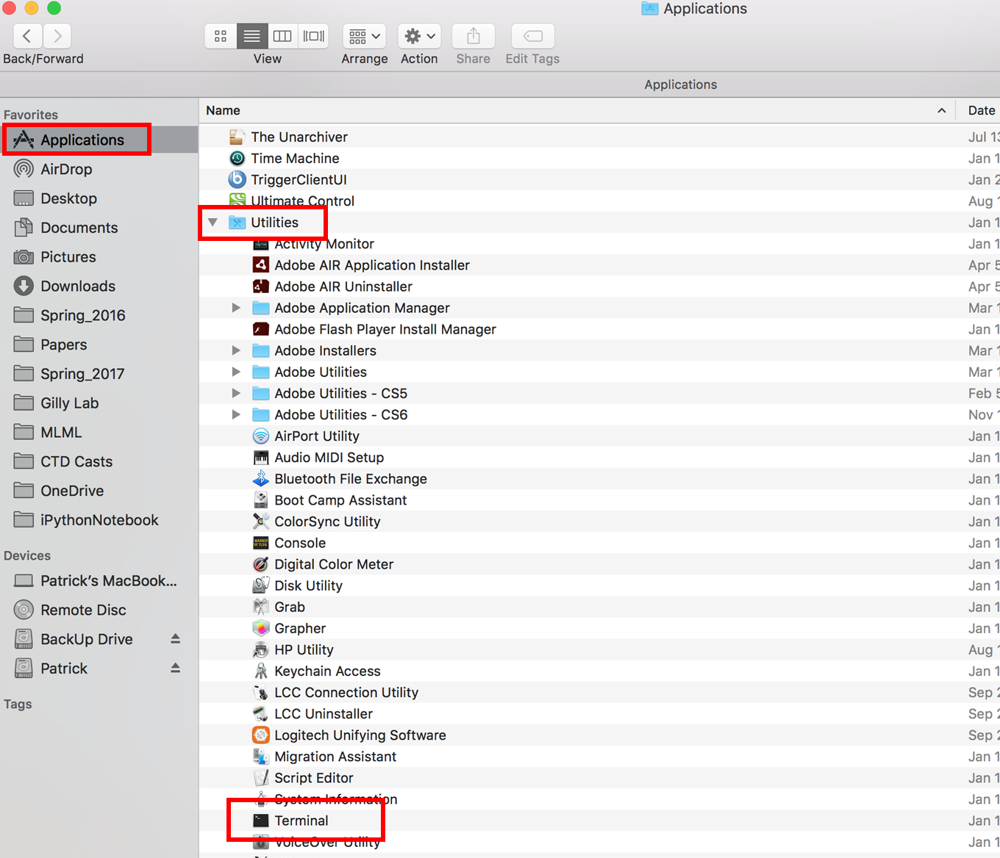
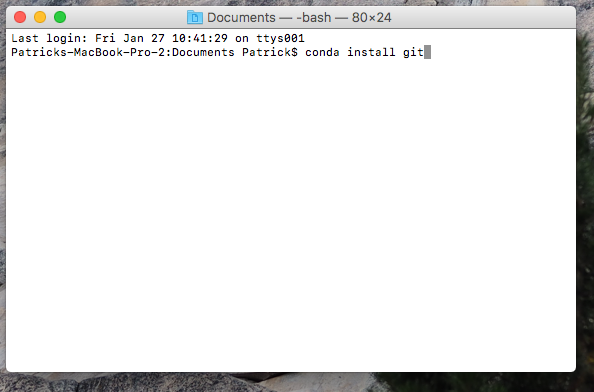
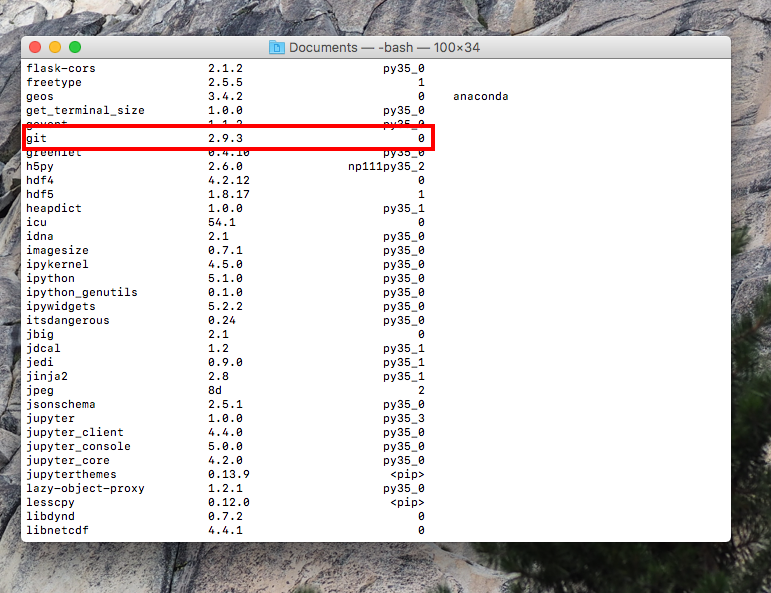

[For Windows instructions](#on-windows) 
[For OSX (Mac) instructions](#on-osx)

## On Windows ##
<h3>Installing Anaconda, Git and a text editor for Windows </h3>
<h4>MS263 Spring 2017</h4>
 
#### What is Anaconda/conda? ####
 
<b>Anaconda</b> is a distribution of python and a set of packages and programs that was built specifically for data science.
This includes: <b>conda</b> (Package Manager), <b>Python</b> (will be using version 3.5), <b>jupyter-notebook</b> (that is what this is!) and  <b>spyder</b> (as well as others)
 
<b>Conda</b> is a Package and Environment manager made by Continuum Analytics
 
What is a Package Manager?
 
Package manager: Maintains the directories (folder pathways) and versions of external (non-default) python packages
A package is just a collection of code that can make you life a lot easier, some of these are included with python, but others have to be downloaded from an external source.
 
Environment: You can think of this as having different "Versions" of python installed. This can be useful for debugging, if you want to emulate another computer that doesn’t have all of your packages and preferences installed, but for our purpose, we will just be using the default environment

### Installing on Windows ###
Check to see if your operating system is 32-but or 64-bit (Chances are with a newer computer, it is 64-bit)

Go to: https://www.continuum.io/downloads  
Select <b>Python 3.5 version</b> (we will be using Python 3 for this course)

### Installing Git ###
After installing Anaconda, open the program <b>"Command Prompt"</b>
You might have to search for this in the start menu. 

Then, run the command "<b>Conda install git</b>" in the terminal

This will install <b>git</b>, an important version control software  There may be a dialog asking you to installing or updating additional package. Enter "Y" and press enter. 
Now we want to verify that <b>git</b> is installed using the following command in the command prompt:  
<b>"conda list"</b>

This will display all of the packages and programs installed in this environment. Scroll down till you see <b>git</b>. This will tell you the version of the software or package. 

For the windows users, we will use a program that comes with git called <b>Git-Bash</b>. This is a Bash Shell, similar to the terminal on Unix (OSX and Linux) machines and using this will help us maintain continuity between both types of operating systems.

#### Signup for an account at <a>www.github.com</a> ####
Github is a popular remote repository hosting service. This is a way to store and share version controlled software off of your computer. You can think of this sort of like dropbox for code and something we will use extensively in this class, but more on that later.

#### Choosing a Text Editor ####
Text editors do exactly what their name implies (and often a lot more).
For Windows here is a list non-exhaustive list of text editors,
 
<b>Notepad</b> - This comes installed on windows.

<b>Notepad ++</b>  - Has a ton of features and is very customizable

<b>Atom</b> - from the Github folks, has easy to use git support and some cool custom plugins
 
There are hundreds of more options, so don’t be afraid to try some out.

<a name="osx_anchor"><h2>Installing Anaconda, Git and a text editor for OSX </h2></a><h4>MS263 Spring 2017</h4>
 
#### What is Anaconda/conda? ####
 
<b>Anaconda</b> is a distribution of python and a set of packages and programs that was built specifically for data science.
This includes: <b>conda</b> (Package Manager), <b>Python</b> (will be using version 3.5), <b>jupyter-notebook</b> (that is what this is!) and  <b>spyder</b> (as well as others)
 
<b>Conda</b> is a Package and Environment manager made by Continuum Analytics
 
What is a Package Manager?
 
Package manager: Maintains the directories (folder pathways) and versions of external (non-default) python packages
A package is just a collection of code that can make you life a lot easier, some of these are included with python, but others have to be downloaded from an external source.
 
Environment: You can think of this as having different "Versions" of python installed. This can be useful for debugging, if you want to emulate another computer that doesn’t have all of your packages and preferences installed, but for our purpose, we will just be using the default environment
 
 
# On OSX #
Check to see if your operating system is 32-but or 64-bit (Chances are with a newer computer, it is 64-bit)

Go to: https://www.continuum.io/downloads  
Select <b>Python 3.5 version</b> (we will be using Python 3 for this course)

### Installing Git ###
After installing Anaconda, open the program <b>"terminal"</b>
This is located in Applications -> Utilities 
Or you can search for "terminal" in the spotlight (use press cmd-space).

 

Then, run the command "<b>Conda install git</b>" in the terminal

This will install <b>git</b>, an important version control software  There may be a dialog asking you to installing or updating additional package. Enter "Y" and press enter. 
Now we want to verify that <b>git</b> is installed using the following command in terminal:  
<b>"conda list"</b>
  
This will display all of the packages and programs installed in this environment. Scroll down till you see <b>git</b>. This will tell you the version of the software or package.  

#### Signup for an account at <a>www.github.com</a> ####
Github is a popular remote repository hosting service. This is a way to store and share version controlled software off of your computer. You can think of this sort of like dropbox for code and something we will use extensively in this class, but more on that later.

#### Choosing a Text Editor ####
Text editors do exactly what their name implies (and often a lot more).
For OSX here is a list non-exhaustive list of text editors,
 
<b>TextEdit</b> - This comes by default.

<b>TextWrangler</b>  - Has a ton of features and is very versatile.

<b>Atom</b> - from the Github folks, has easy to use git support and some cool custom plugins
 
There are hundreds of more options, so don’t be afraid to try some out.
